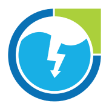
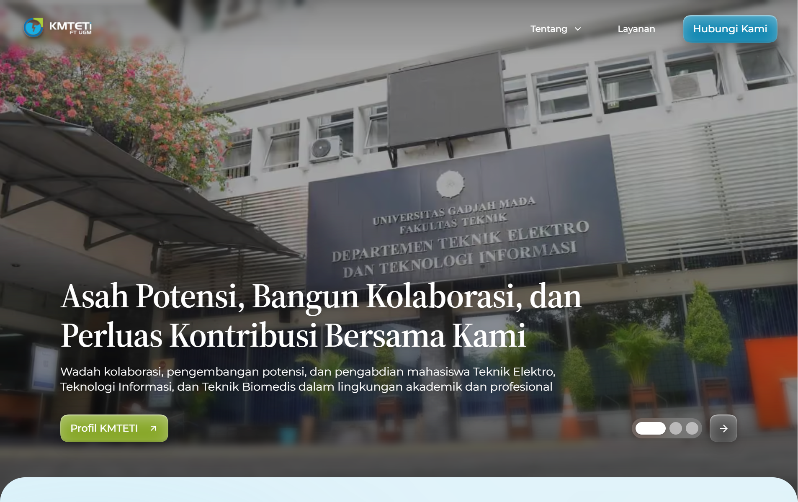
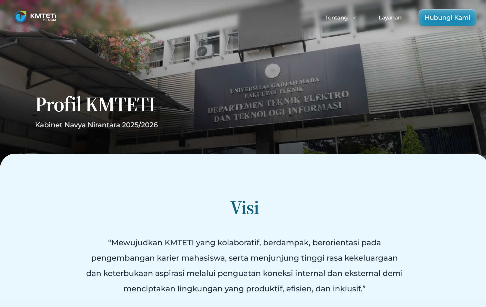
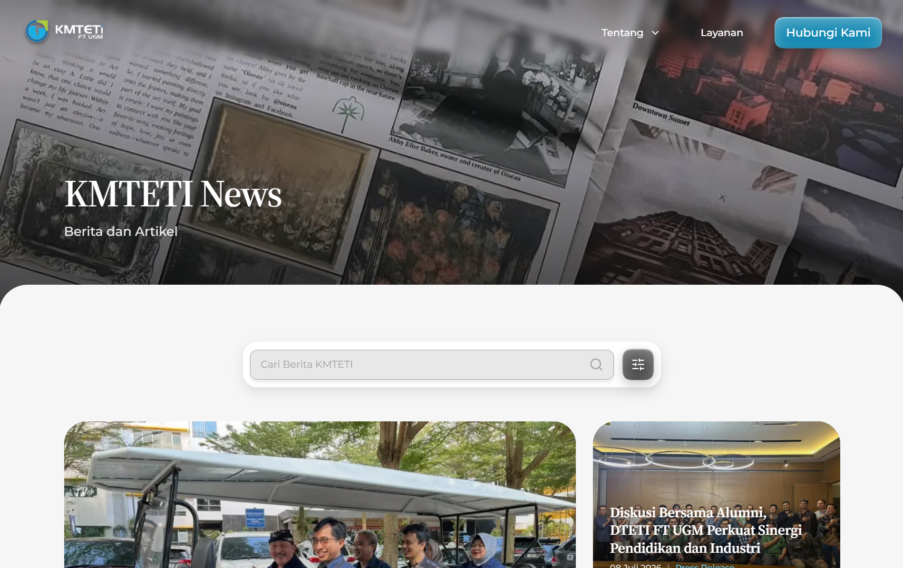
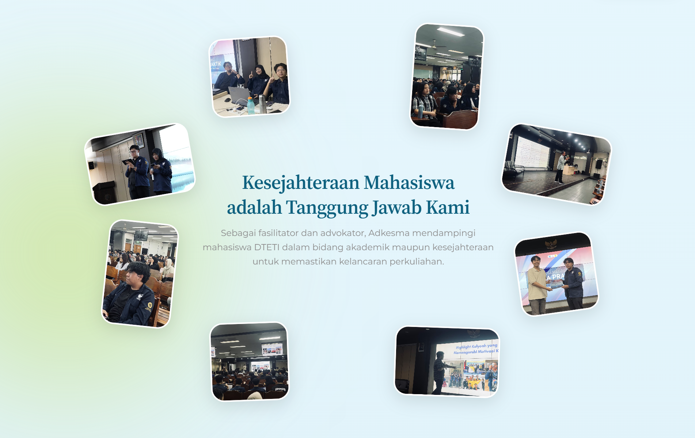
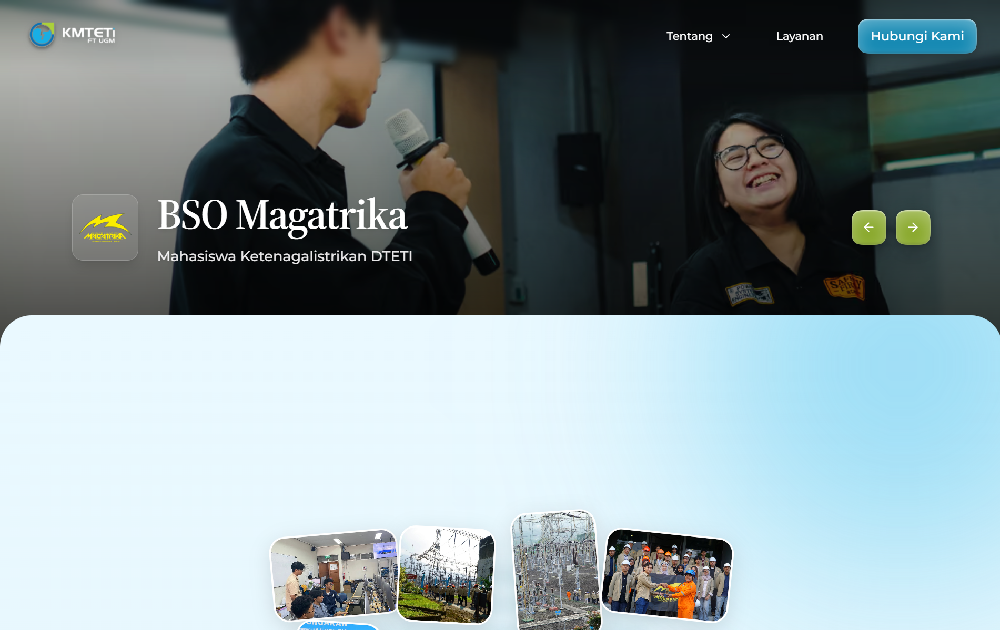
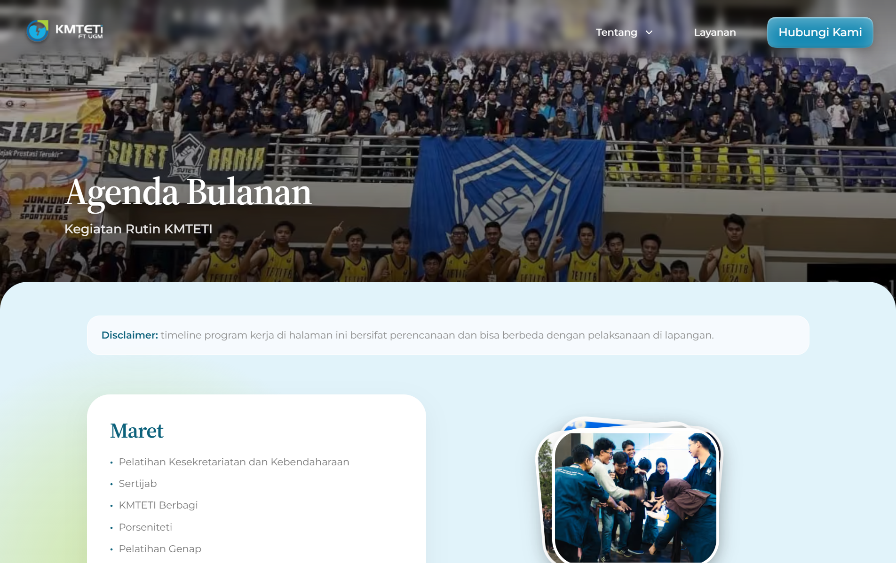
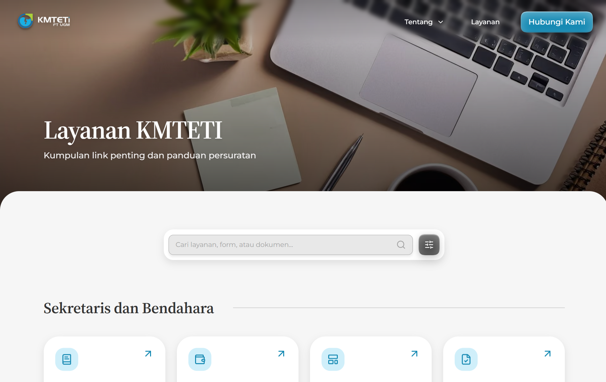
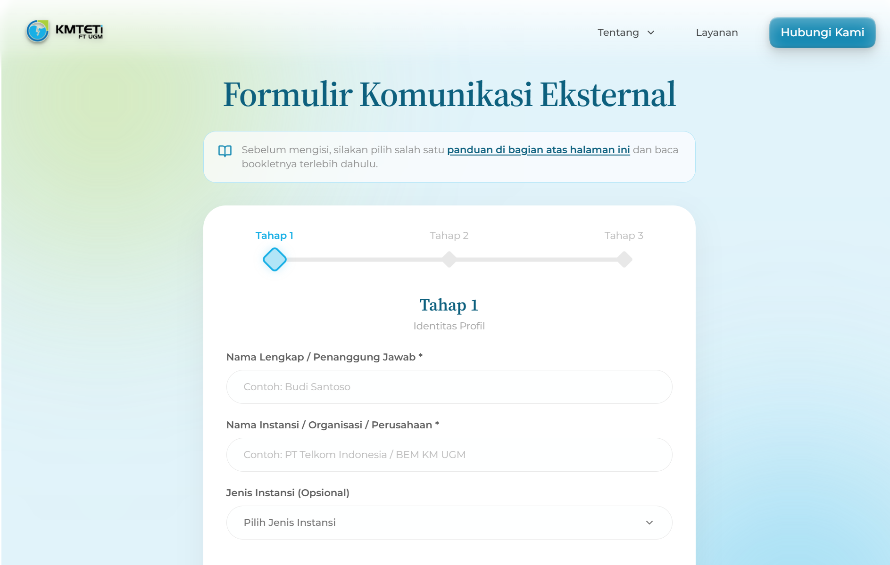
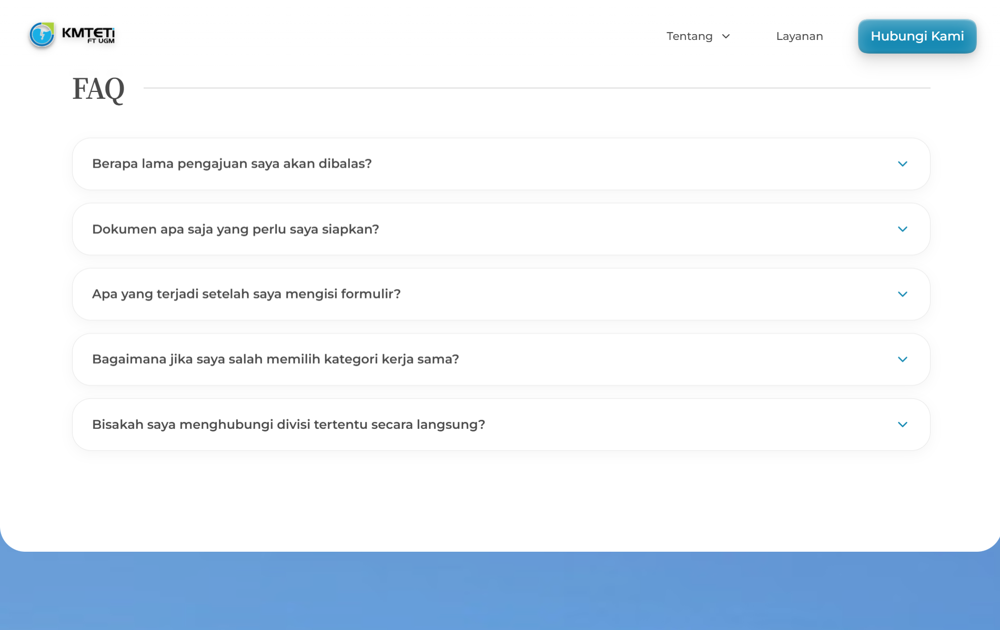

<div align="center">
  <a href="https://kmteti.ft.ugm.ac.id">
    
  </a>
  <h1 align="center">Website KMTETI FT UGM</h1>
  <p align="center">
    <i>Official Web Portal of Keluarga Mahasiswa Teknik Elektro dan Teknologi Informasi (KMTETI) FT UGM 🚀</i>
  </p>

  <p align="center">
    <a href="https://www.instagram.com/kmteti/"></a>
    <a href="https://www.youtube.com/@kmteti"></a>
    <a href="https://x.com/KMTETI"></a>
    <a href="https://www.linkedin.com/company/kmteti-ft-ugm"></a>
    <a href="https://www.tiktok.com/@kmteti"></a>
  </p>
</div>

<p align="center">
  
</p>

---

## 📌 Pendahuluan

**Website KMTETI FT UGM** adalah platform web terpadu resmi yang dirancang untuk menjadi pusat informasi organisasi, publikasi berita kegiatan, profil kepengurusan kabinet, direktori program kerja divisi & BSO, informasi event nasional, serta pusat layanan akademik dan persuratan bagi seluruh civitas akademika Departemen Teknik Elektro dan Teknologi Informasi FT UGM.

Website ini dibangun dengan standar rekayasa perangkat lunak modern: **Next.js 15 App Router**, **Payload CMS 3.0**, **PostgreSQL & Storage via Supabase**, **Tailwind CSS v4**, dan animasi interaktif **GSAP ScrollTrigger**.

---

## 📸 Pages & Features Showcase

<details open>
<summary><b>Klik untuk melihat galeri fitur & antarmuka halaman</b></summary>
<br />

<p align="center">
  
  &nbsp;
  
</p>

<p align="center">
  
  &nbsp;
  
</p>

<p align="center">
  
  &nbsp;
  
</p>

<p align="center">
  
  &nbsp;
  
</p>

</details>

---

## 🛠️ Tech Stack & Arsitektur

| Komponen | Teknologi | Keterangan |
| :--- | :--- | :--- |
| **Framework Utama** | [Next.js 15](https://nextjs.org) (React 19) | App Router, Server Components, Image Optimization |
| **Bahasa** | [TypeScript](https://www.typescriptlang.org) | Strict type-safety end-to-end |
| **Content Management** | [Payload CMS 3.0](https://payloadcms.com) | Embedded Admin Panel, Lexical RichText Editor, Local API |
| **Database** | [PostgreSQL (Supabase)](https://supabase.com) | Connection pooling via `@payloadcms/db-postgres` |
| **Media Storage** | [Supabase Storage (S3 API)](https://supabase.com) | S3 protocol via `@payloadcms/storage-s3` |
| **Styling & UI** | [Tailwind CSS v4](https://tailwindcss.com) + [Radix UI](https://www.radix-ui.com) | Modern Design Tokens & Glassmorphism |
| **Animasi Interaktif** | [GSAP ScrollTrigger](https://greensock.com/gsap) | GPU-accelerated Masked Curtain & Stagger waterfall |
| **Sinkronisasi Kontak** | Google Apps Script API | Sinkronisasi background otomatis form ke Google Sheets |

---

## 🚀 Panduan Memulai (Getting Started)

### 1. Prasyarat Sistem
Pastikan perangkat Anda telah terpasang:
- **Node.js**: Versi `^18.20.2` atau `>=20.9.0`
- **Package Manager**: `npm` atau `pnpm` (`^9` / `^10`)
- **Git**

### 2. Kloning Repositori
```bash
git clone https://github.com/kmteti/website-bergelora.git
cd website-bergelora
```

### 3. Konfigurasi Variabel Lingkungan (`.env`)
Salin file template `.env.example` menjadi `.env`:
```bash
cp .env.example .env
```
Isi nilai-nilai variabel lingkungan seperti `DATABASE_URI`, `PAYLOAD_SECRET`, dan kredensial Supabase S3 sesuai panduan di [docs/05-database-and-storage.md](docs/05-database-and-storage.md).

### 4. Instalasi Dependensi
```bash
npm install
# atau menggunakan pnpm
pnpm install
```

### 5. Menjalankan Server Pengembangan
```bash
npm run dev
# atau
pnpm dev
```
Buka [http://localhost:3000](http://localhost:3000) di browser untuk melihat website, dan [http://localhost:3000/admin](http://localhost:3000/admin) untuk masuk ke panel admin Payload CMS.

---

## 📋 Daftar Perintah Tersedia (Available Scripts)

| Perintah | Fungsi |
| :--- | :--- |
| `npm run dev` | Menjalankan server pengembangan Next.js |
| `npm run build` | Melakukan build produksi dan validasi rute statis/dinamis |
| `npm run start` | Menjalankan server produksi hasil build |
| `npm run lint` | Menjalankan ESLint untuk memeriksa kualitas kode |
| `npm run generate:types` | Meregenerasi file tipe TypeScript dari schema Payload (`src/payload-types.ts`) |
| `npm run generate:importmap` | Meregenerasi import map untuk custom admin components |
| `npm run devsafe` | Menghapus cache `.next` lalu menjalankan server pengembangan |

---

## 📚 Dokumentasi Teknis Lengkap

Dokumentasi arsitektur dan sistem Website KMTETI FT UGM telah disusun secara menyeluruh di dalam folder `docs/`:

1. 🏛️ **[01. Architecture & Component Catalog](docs/01-architecture-overview.md)**: Pola pemisahan modul, hierarki layout, 16 rute URL, dan katalog komponen UI.
2. 📦 **[02. Payload CMS 3.0 Guide](docs/02-payload-cms-guide.md)**: Arsitektur CMS, Local API, bedah 10 Collections, dan strategi migrasi.
3. 🎨 **[03. Design System & Animation Guide](docs/03-design-guide.md)**: Palet warna, tipografi, token glassmorphism, dan panduan animasi GSAP ScrollTrigger.
4. 📝 **[04. Form & External Integrations](docs/04-form-integrations.md)**: Multi-step contact form, sinkronisasi Google Sheets Webhook, dan WhatsApp Deep-link.
5. 🗄️ **[05. Database & Storage Architecture](docs/05-database-and-storage.md)**: Konfigurasi PostgreSQL Supabase, pooling, dan Supabase Storage S3.

---

## 👥 Kontributor

Website ini dikembangkan dan dikelola secara aktif oleh **Divisi Informasi dan Komunikasi (Infokom) KMTETI FT UGM** bersama seluruh kontributor:

<p align="center">
  <a href="https://github.com/kmteti/website-bergelora/graphs/contributors">
    
  </a>
</p>

---

## 📄 Lisensi

Proyek ini dilisensikan di bawah lisensi **MIT License** (lihat file [LICENSE](LICENSE) untuk detail lebih lanjut).

<div align="center">
  <sub><b>Teti Satu!</b></sub>
</div>
